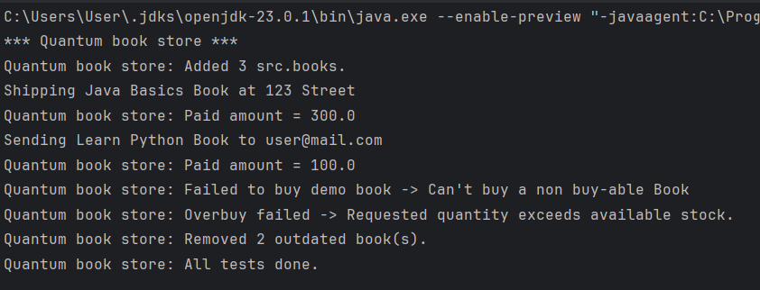
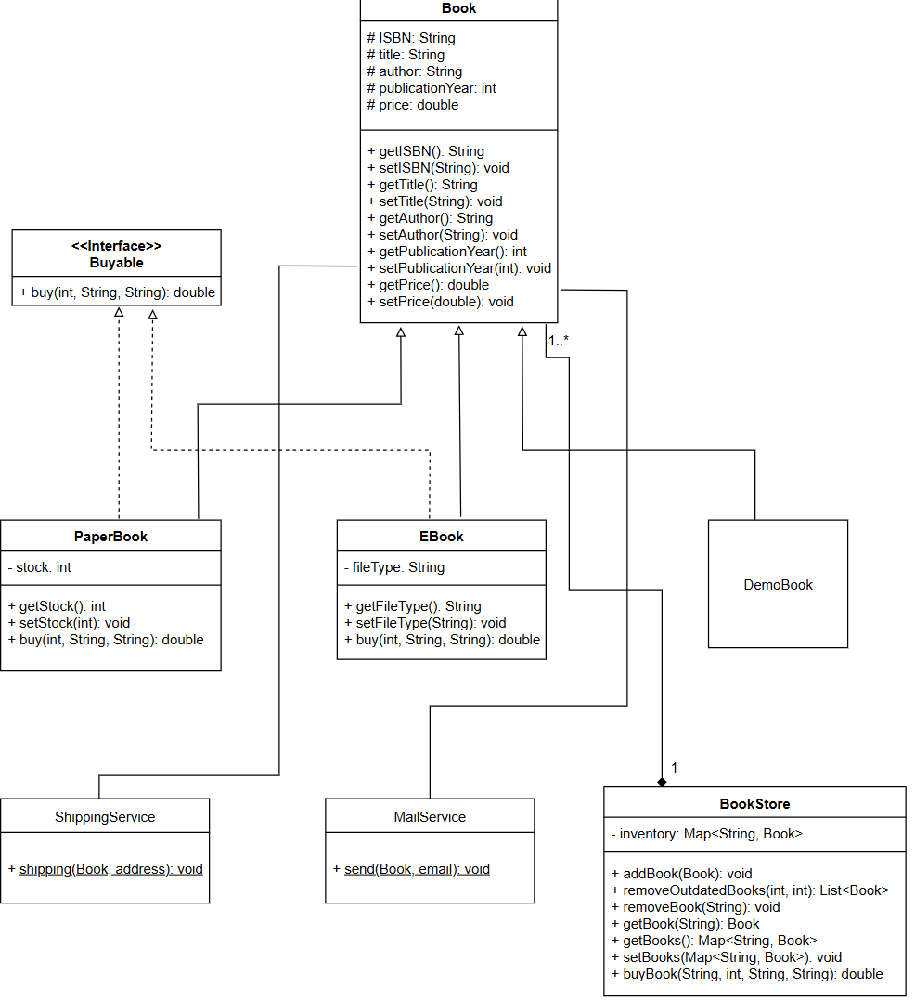

# Quantum Bookstore

Quantum Bookstore is a simple, Java console-based system that manages various types of books, including physical, digital, and demo. It demonstrates clean object-oriented design with inheritance, interfaces, and exception handling.

---

## Screenshot from a running app

---

## Features

- Add books to the inventory
- Buy books by ISBN (supports quantity, email, address)
- Remove outdated books based on publication year
- Uses shipping and mail services (simulated)
- Clean separation of model, service, and logic layers

---

## Book Types

- **PaperBook**
    - Has stock
    - Can be shipped to a physical address
- **EBook**
    - Has file type (e.g., PDF)
    - Can be sent via email
- **DemoBook**
    - Not for sale (throws exception if purchase attempted)
---
## 📊 Class Diagram

---
## Project Structure
- `src/`
  - `books/`
      - `Book.java`
      - `DemoBook.java`
      - `EBook.java`
      - `PaperBook.java`
      - `interfaces/`
          - `Buyable.java`
  - `services/`
      - `MailService.java`
      - `ShippingService.java`
  - `store/`
      - `BookStore.java`
  - `test/`
      - `QuantumBookstoreTest.java`
- `assets`
  - `class_diagram.png`
---
## Testing

The test class `QuantumBookstoreTest` demonstrates:

- Adding all types of books
- Buying paper and ebooks
- Handling exceptions (e.g., out of stock, buying demo)
- Removing outdated books
